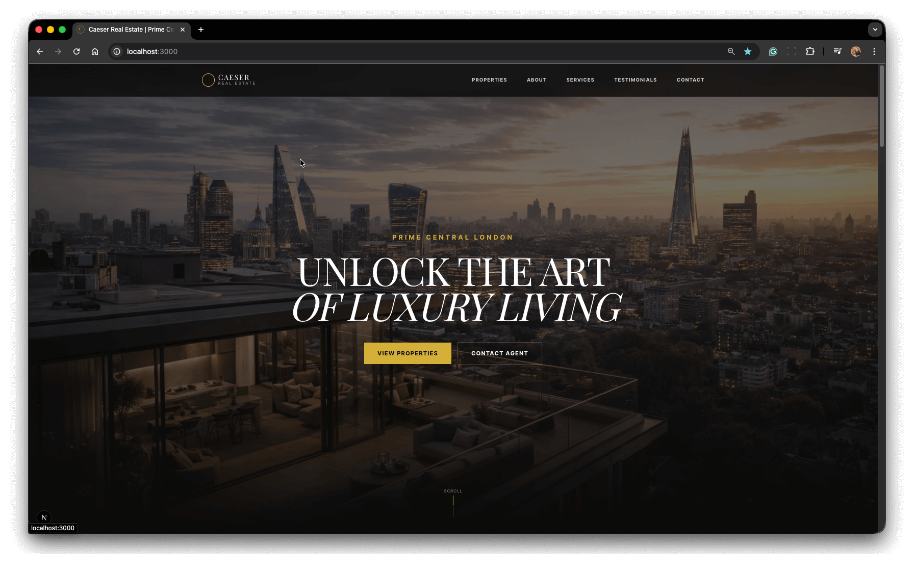
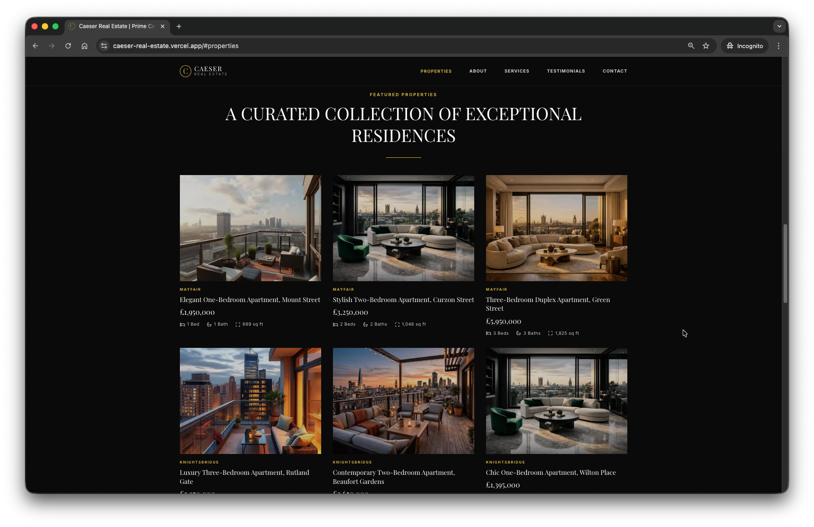
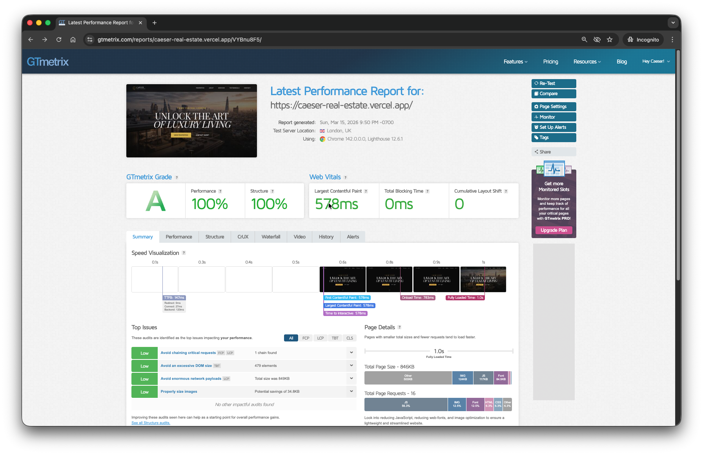
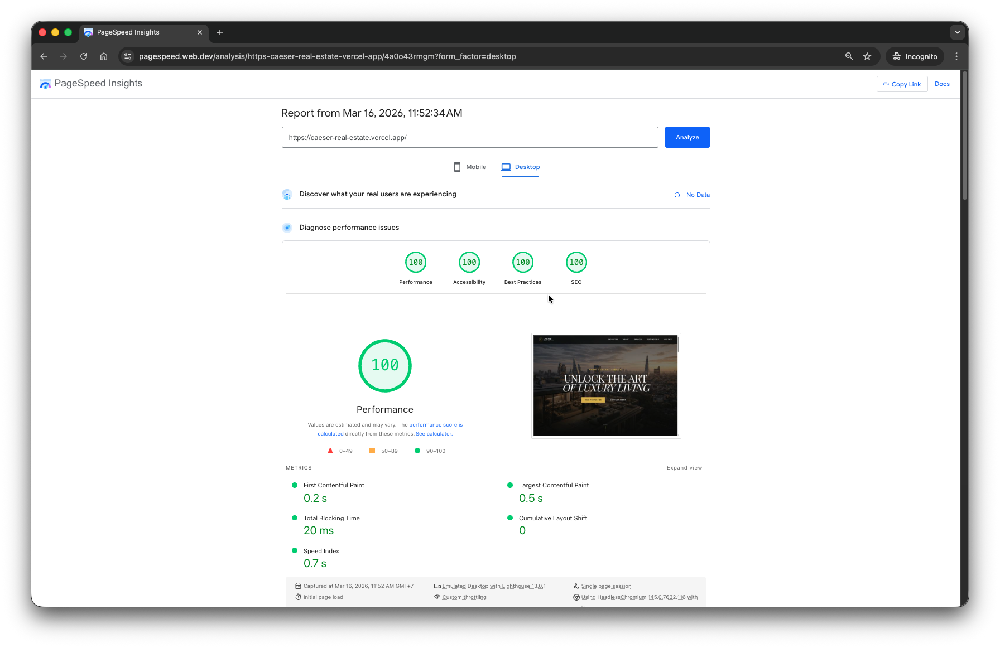

  

    
    <h1 style="margin: 0; display: inline;">Caeser Real Estate</h1>
  

  
  

A modern luxury real estate experience built with **Next.js 15**, **React 19**, **TypeScript**, and **Tailwind CSS 4**, **Motion** for subtle premium animations .

Caeser Real Estate is a polished front-end property platform designed to showcase premium listings with a refined visual style, smooth interactions, and a clean user experience. The project focuses on elegant presentation, responsive layouts, and modern React architecture.

**Live Demo:** [caeser-real-estate.vercel.app](https://caeser-real-estate.vercel.app/)

## Overview

  
  

This project was created as a high-end real estate web experience with a strong focus on premium design, refined user experience, and top-tier front-end performance.

It achieved **full scores across key testing categories**, including **performance, structure, accessibility, best practices, and SEO**, demonstrating that the site was built not only to look luxurious, but also to perform at an exceptional standard.

Key priorities for this project included:

- premium visual design
- responsive layouts across devices
- smooth animated interactions
- reusable component architecture
- clean modern code with TypeScript
- fast performance with the latest Next.js features

It includes a stylish landing page, featured property sections, and individual property detail pages designed to feel modern, minimal, upscale, and highly optimized.

## Built With

### Core

- **Next.js 15.4.9**
- **React 19.2.1**
- **React DOM 19.2.1**
- **TypeScript 5.9.3**

### Styling and UI

- **Tailwind CSS 4.1.11**
- **@tailwindcss/postcss 4.1.11**
- **@tailwindcss/typography**
- **autoprefixer**
- **clsx**
- **tailwind-merge**
- **class-variance-authority**
- **tw-animate-css**
- **lucide-react**

### Motion and Interaction

- **motion**

### Forms and Validation

- **@hookform/resolvers**

### Tooling

- **ESLint 9**
- **eslint-config-next**
- **@types/node**
- **@types/react**
- **@types/react-dom**

## Features

- Luxury real estate landing page
- Property listing cards with premium visual styling
- Dedicated property detail pages
- Reusable UI components
- Smooth motion and interaction effects
- Responsive mobile-first layout
- Clean typography and spacing
- Modern App Router structure with Next.js
- Type-safe development with TypeScript

## Why This Project

Caeser Real Estate was built to demonstrate how modern front-end tools can be combined to create a visually rich product experience.

The goal was not just to build a property website, but to create something that feels elevated, editorial, and premium — more like a luxury brand experience than a standard listing platform.

## Tech Approach

This project uses the latest modern front-end stack to keep the codebase clean, scalable, and maintainable.

- **Next.js App Router** for modern routing and page structure
- **React 19** for component-driven UI
- **TypeScript** for safer, clearer development
- **Tailwind CSS 4** for fast and consistent styling
- **Motion** for subtle premium animations
- **CVA + clsx + tailwind-merge** for reusable and composable styling patterns
- **Lucide React** for crisp iconography
